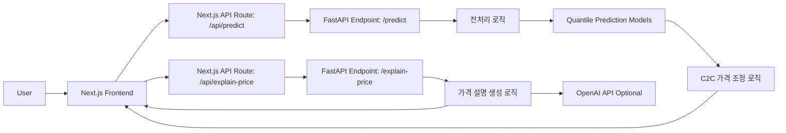

# fa08-2nd-Bermuda | C2C 중고차 적정 판매가격 예측 및 판매 지원 서비스

> **개인 중고차 판매자가 “얼마에 올려야 팔릴까?”를 더 합리적으로 판단할 수 있도록 돕는 AI 기반 가격 예측 서비스**  
> 공개 중고차 매물 데이터를 바탕으로 차량 정보를 입력하면 **빠른 판매가 / 적정 판매가 / 기대 판매가**를 제안하고, 가격 형성 이유까지 함께 안내합니다.

<p align="left">
  
  
  
  
  
</p>

## 프로젝트 한눈에 보기

| 항목 | 내용 |
| --- | --- |
| 팀명 | Bermuda |
| 팀원 | 박찬호 · 이동현 · 최아영 |
| 프로젝트 유형 | AI 기반 가격 예측 서비스 |
| 도메인 | C2C 중고차 개인 판매 지원 |
| 핵심 결과 | 빠른 판매가 / 적정 판매가 / 기대 판매가 제안 |
| 구현 범위 | 데이터 수집 · 전처리 · 모델 학습 · API · 프런트엔드 · 배포 |
| 프런트엔드 | Next.js · React · TypeScript |
| 백엔드 | FastAPI · Python |
| 배포 환경 | Vercel · Render |
| 웹페이지 | https://car-price-bermuda.vercel.app/ |

## 왜 만들었나

중고차 개인 판매자는 차량 상태를 가장 잘 알고 있어도, **정작 얼마에 올려야 적절한지 판단하기 어려운 순간**을 자주 마주합니다.
너무 높게 올리면 거래가 지연되고, 너무 낮게 올리면 손해를 볼 수 있습니다.

얼마Car는 이 문제를 해결하기 위해 기획된 서비스입니다.  
단순히 평균 시세 하나를 보여주는 대신, 판매 목적에 따라 참고할 수 있는 **전략형 가격 가이드**를 제공하고, 입력값 검증과 검토 화면을 통해 **등록 전 의사결정 경험 자체를 돕는 것**을 목표로 했습니다.

## 서비스 핵심 아이디어

- **하나의 정답 가격** 대신 판매 전략별 가격을 제안합니다.
- 예측값만 던지고 끝내지 않고, **입력 정보 요약과 가격 설명**을 함께 제공합니다.
- 데이터 수집부터 모델 학습, API 서빙, 프런트 구현, 배포까지 이어지는 **엔드투엔드 AI 서비스 포트폴리오**를 지향합니다.

## 주요 기능

- 차량 정보 입력 및 필수값 검증
- 입력 내용 검토 화면 제공
- 예측 API 연동을 통한 가격 산정
- 빠른 판매가 / 적정 판매가 / 기대 판매가 제안
- 가격 설명 생성
- 프런트엔드 / 백엔드 분리형 구조
- 로컬 실행 및 배포 환경 구성

## 사용자 흐름


## 시스템 아키텍처 요약



## 저장소 구조

```text
app/                        Next.js 앱 라우터
components/screens/         화면 단위 프런트엔드 컴포넌트
backend/                    FastAPI API, 전처리 코드, 학습된 모델 파일
machine_learning/           크롤링, 전처리, 학습 실험 산출물
public/                     아이콘 등 정적 자산
README.md                   프로젝트 문서
```

## 실행 방법

### 1. 프런트엔드

```bash
npm install
copy .env.example .env.local
npm run dev
```

기본 API 주소는 `http://127.0.0.1:8000` 입니다.

### 2. 백엔드

```bash
python -m venv .venv
.venv\Scripts\activate
pip install -r backend/requirements.txt
copy backend\.env.example backend\.env
npm run backend:dev
```

`OPENAI_API_KEY`는 선택 사항입니다. 값이 없으면 가격 설명은 기본 문구로 반환됩니다.

## 주요 파일

- `app/page.tsx`: 프런트엔드 전체 플로우를 관리합니다.
- `components/screens/`: 환영, 입력, 요약, 결과 화면을 분리해 둔 UI 컴포넌트입니다.
- `backend/main.py`: 예측 API와 가격 설명 생성 로직이 들어 있습니다.
- `backend/preprocess.py`: 입력값을 모델 피처 형태로 변환합니다.
- `backend/models/`: 예측에 필요한 학습 결과물입니다.
- `machine_learning/`: 크롤링, 전처리, 모델 실험 및 학습 관련 산출물을 관리합니다.

## 비고

- 저장소에는 실행에 필요한 모델 파일만 남기고, 생성 산출물과 사용하지 않는 보일러플레이트는 정리했습니다.
- 현재 패키지 매니저는 `npm` 기준으로 정리되어 있습니다.
- 회고, 대시보드 스크린샷, 배포 링크 등 일부 항목은 추후 업데이트를 전제로 빈칸을 유지했습니다.


---

# 프로젝트 기획서

## 1. 프로젝트 정의

### 1-1. 프로젝트명
- **얼마Car | C2C 중고차 적정 판매가격 예측 및 판매 지원 서비스**

### 1-2. 프로젝트 목표
- 개인 고차 판매자가 차량 조건을 바탕으로 **적정 등록 가격을 합리적으로 판단**할 수 있도록 지원
- 단일 가격 제시가 아닌 **빠른 판매가 / 적정 판매가 / 기대 판매가**의 3단계 가격 전략 제공
- 입력 검증과 검토 화면을 포함한 UX를 통해 **등록 전 의사결정 정확도 향상**
- 데이터 수집부터 전처리, 모델 학습, API 연동, 프런트엔드 구현, 배포까지 연결되는 **서비스형 AI 프로젝트 포트폴리오 구축**

### 1-3. 문제 정의
- 중고차 개인 직거래에서는 **가격 정보 비대칭**으로 인해 판매자가 적정 가격을 정하기 어렵다.
- 등록 가격이 높으면 거래가 지연되고, 낮으면 손해를 볼 수 있어 **가격 결정 부담**이 크다.
- 단순 평균 시세나 감각적 판단만으로는 부족하며, **내 차량 상태를 반영한 맞춤형 가격 가이드**가 필요하다.
- 플랫폼 관점에서도 비합리적인 등록 가격은 **문의 전환율 저하와 거래 신뢰도 하락**으로 이어질 수 있다.

### 1-4. 서비스 핵심 아이디어
- 사용자의 판매 목적은 모두 같지 않다는 점에 주목하여, 하나의 정답 가격이 아니라 **전략형 가격 제안**을 제공한다.
- 빠르게 팔고 싶은 사용자, 적정한 수준에서 거래하고 싶은 사용자, 높은 가격을 기대하는 사용자가 각각 참고할 수 있도록 가격 결과를 구분한다.
- 결과값만 제시하는 것이 아니라, 가격 형성 이유와 입력값 요약을 함께 제공해 **설명 가능한 사용자 경험**을 목표로 한다.

### 1-5. 주요 기능
- 차량 정보 입력
- 입력값 유효성 검사
- 입력 내용 검토 화면
- 가격 예측 API 연동
- 빠른 판매가 / 적정 판매가 / 기대 판매가 제안
- 가격 설명 생성
- 프런트엔드 / 백엔드 분리형 서비스 구조
- 로컬 실행 및 배포 환경 구성

## 2. 주요 내용

| 항목 | 내용 |
| --- | --- |
| 프로젝트 기간 | 2026-03-11 ~ 2026-03-24 |
| 참여 인원 | 박찬호, 이동현, 최아영 |
| 프로젝트 유형 | AI 예측 서비스 구축 |
| 적용 도메인 | C2C 중고차 개인 판매 지원 |
| 데이터 사용처 | 공개 중고차 매물 데이터 기반 학습 및 서비스 구현 |
| 프런트엔드 | Next.js / React / TypeScript |
| 백엔드 | FastAPI / Python |
| 배포 환경 | Vercel / Render |
| 웹페이지 |https://car-price-bermuda.vercel.app/|

## 3. 일정 계획

| 작업 항목 | 시작 날짜 | 종료 날짜 | 기간(일) |
| --- | --- | --- | --- |
| AI 예측 서비스 구축 | 2026-03-11 | 2026-03-20 | 10 |
| 기획 및 요구사항 정의 | 2026-03-11 | 2026-03-13 | 3 |
| 데이터 수집 및 전처리 | 2026-03-13 | 2026-03-17 | 5 |
| 예측 모델 개발 | 2026-03-16 | 2026-03-18 | 3 |
| 시스템 구현 | 2026-03-18 | 2026-03-19 | 2 |
| 테스트 및 배포 | 2026-03-19 | 2026-03-20 | 2 |
| 발표 준비 및 발표 | 2026-03-19 | 2026-03-20 | 2 |

---

# 작업 분할 구조 (WBS)

## 1. 단계별 작업 구성

### 1. 기획 및 요구사항 정의
- 1.1 서비스 목표 및 범위 정의
- 1.2 핵심 기능 및 요구사항 정의
- 1.3 사용자 흐름 및 가격 제안 UX 설계

### 2. 데이터 수집 및 전처리
- 2.1 차량 데이터 필드 및 품질 기준 정의
- 2.2 중고차 매물 데이터 수집
- 2.3 데이터 정제·통합 및 분할

### 3. 예측 모델 개발
- 3.1 가격 예측 모델 설계 및 학습
- 3.2 모델 성능 검증 및 튜닝
- 3.3 예측 결과 연동 테스트

### 4. 시스템 구현
- 4.1 사용자 화면 및 서버 기능 구현
- 4.2 예측 모델 API 연동
- 4.3 실행 환경 및 배포 환경 구성

### 5. 테스트 및 배포
- 5.1 단위·통합·E2E 테스트
- 5.2 결함 수정 및 안정화
- 5.3 최종 배포 및 운영 점검

### 6. 발표 준비 및 발표
- 6.1 발표 자료 제작
- 6.2 발표 스크립트 작성
- 6.3 발표 리허설 및 최종 발표

## 2. 상세 WBS

| WBS 코드 | Phase/구분 | 작업명 | 설명 | 시작일 | 종료일 |
| --- | --- | --- | --- | --- | --- |
| 1.0 | 전체 | AI 예측 서비스 구축 | 기획~데이터~모델~구현~배포 전체 범위 | 2026/03/11 | 2026/03/20 |
| 1.1 | 기획 및 요구사항 정의 | 기획 및 요구사항 정의 | 서비스 목표/기능/UX 흐름 정의 | 2026/03/11 | 2026/03/13 |
| 1.1.1 |  | 서비스 목표 및 범위 정의 | 판매자 대상 가격 예측 서비스 목표, KPI, 적용 범위 정의 | 2026/03/11 | 2026/03/12 |
| 1.1.2 |  | 핵심 기능 및 요구사항 정의 | 가격 예측, 입력 검증, 결과 제공 기능과 우선순위 정의 | 2026/03/12 | 2026/03/13 |
| 1.1.3 |  | 사용자 흐름 및 가격 제안 UX 설계 | 판매가격 입력부터 추천가격 확인까지 사용자 흐름과 UX 설계 | 2026/03/12 | 2026/03/13 |
| 1.2 | 데이터 수집 및 전처리 | 중고차 데이터 수집 및 학습데이터 구축 | 차량 정보 수집, 정제, 통합을 통해 학습용 데이터셋 구축 | 2026/03/13 | 2026/03/17 |
| 1.2.1 |  | 차량 데이터 필드 및 품질 기준 정의 | 타깃·피처 정의, 데이터 사전 작성, 품질 기준 수립 | 2026/03/13 | 2026/03/16 |
| 1.2.2 |  | 중고차 매물 데이터 수집 | 중고차 매물 데이터 소스 확인, 추출, 적재 및 샘플 확보 | 2026/03/13 | 2026/03/16 |
| 1.2.3 |  | 데이터 정제·통합 및 분할 | 결측·이상치 처리, 데이터 통합, 학습/평가 데이터 분할 | 2026/03/16 | 2026/03/17 |
| 1.3 | 예측 모델 개발 | 중고차 가격 예측 모델 개발 | 적정 판매가격 예측 모델 설계, 학습, 검증 및 서비스 연계 준비 | 2026/03/16 | 2026/03/18 |
| 1.3.1 |  | 가격 예측 모델 설계 및 학습 | 베이스라인 구축, 피처 엔지니어링, 후보 모델 비교 | 2026/03/16 | 2026/03/16 |
| 1.3.2 |  | 모델 성능 검증 및 튜닝 | 평가 지표 설계, 검증 전략 수립, 튜닝 및 성능 관리 | 2026/03/16 | 2026/03/17 |
| 1.3.3 |  | 예측 결과 연동 테스트 | 모델 로딩, 추론 결과, 예외 처리 및 화면 연동 검증 | 2026/03/17 | 2026/03/18 |
| 1.4 | 시스템 구현 | 가격 예측 서비스 구현 | 프론트엔드, 백엔드, 모델 API를 연결한 서비스 구현 | 2026/03/18 | 2026/03/19 |
| 1.4.1 |  | 사용자 화면 및 서버 기능 구현 | 입력 화면, 결과 화면, API 구조 및 서버 기능 구현 | 2026/03/18 | 2026/03/18 |
| 1.4.2 |  | 예측 모델 API 연동 | 추론 API, 입력 검증, 전처리, 로깅 구조 연동 | 2026/03/18 | 2026/03/18 |
| 1.4.3 |  | 실행 환경 및 배포 환경 구성 | 실행 환경, 패키지 의존성, 로컬 실행 및 배포 환경 설정 | 2026/03/18 | 2026/03/19 |
| 1.5 | 테스트 및 배포 | 서비스 테스트 및 배포 준비 | 기능 테스트, 오류 수정, 최종 배포와 운영 점검 수행 | 2026/03/19 | 2026/03/20 |
| 1.5.1 |  | 단위·통합·E2E 테스트 | 전처리, 모델, API, 사용자 흐름 단위 및 통합 테스트 수행 | 2026/03/19 | 2026/03/19 |
| 1.5.2 |  | 결함 수정 및 안정화 | 오류 수정, 회귀 테스트, 서비스 안정화 작업 수행 | 2026/03/19 | 2026/03/19 |
| 1.5.3 |  | 최종 배포 및 운영 점검 | 배포 환경 구성, 배포 검증, 운영 가이드 정리 | 2026/03/19 | 2026/03/20 |
| 1.6 | 발표 준비 및 발표 | 성과 정리 및 최종 발표 준비 | 발표 자료, 시연 흐름, 발표 연습 및 최종 발표 준비 | 2026/03/19 | 2026/03/20 |
| 1.6.1 |  | 발표 자료 제작 | 발표 구조 설계, 시각화, 슬라이드 흐름 및 디자인 정리 | 2026/03/19 | 2026/03/20 |
| 1.6.2 |  | 발표 스크립트 작성 | 슬라이드별 핵심 대본 작성, 메시지 정리, 예상 질문 대비 | 2026/03/19 | 2026/03/20 |
| 1.6.3 |  | 발표 리허설 및 최종 발표 | 발표 리허설, 시간 조정, 시연 점검 및 최종 발표 진행 | 2026/03/19 | 2026/03/20 |

---

# 요구사항 정의서

## 기능 요구사항 (Functional Requirements)

| ID | 요구사항 | 설명 |
| --- | --- | --- |
| FR-01 | 차량 정보 입력 | 사용자는 제조사, 모델, 연식, 주행거리, 연료, 사고 여부, 지역 등 주요 차량 정보를 입력할 수 있어야 한다 |
| FR-02 | 필수 입력값 안내 | 필수 입력 항목과 선택 입력 항목이 구분되어야 하며, 사용자가 쉽게 인지할 수 있어야 한다 |
| FR-03 | 입력값 유효성 검사 | 연식, 주행거리, 지역 등 입력값의 누락, 형식 오류, 비정상 범위를 검증하고 즉시 안내해야 한다 |
| FR-04 | 추천 판매가격 제공 | 입력된 차량 정보를 기반으로 적정 판매가격을 제공해야 한다 |
| FR-05 | 전략별 가격 범위 제공 | 빠른 판매, 적정 판매, 최대 수익 등 판매 목적에 따른 가격 범위를 제공해야 한다 |
| FR-06 | 유사 차량 시세 제공 | 입력 차량과 유사한 매물의 평균가, 최저가, 최고가 등 참고 시세를 제공해야 한다 |
| FR-07 | 가격 근거 안내 | 추천 가격에 영향을 준 주요 요인을 사용자가 이해하기 쉽게 제공해야 한다 |
| FR-08 | 결과 화면 제공 | 추천 판매가격, 가격 범위, 시세 정보, 참고 메시지를 한 화면에서 확인할 수 있어야 한다 |
| FR-09 | 희망 판매가 조정 지원 | 사용자는 추천 결과를 참고해 자신의 희망 판매가를 직접 수정할 수 있어야 한다 |
| FR-10 | 입력 정보 요약 제공 | 사용자가 입력한 차량 정보를 결과 화면에서 다시 확인할 수 있어야 한다 |
| FR-11 | 설명문 작성 가이드 제공 | 사고 이력, 수리 내역, 옵션, 관리 상태 등 판매 설명에 포함하면 좋은 정보를 안내해야 한다 |
| FR-13 | 예측 불가 상황 안내 | 데이터 부족 또는 조건 불일치로 가격 산정이 어려운 경우, 그 사유와 대체 안내를 제공해야 한다 |

## 비기능 요구사항 (Non-Functional Requirements)

| ID | 분류 | 요구사항 | 기준 |
| --- | --- | --- | --- |
| NFR-01 | 성능 | 결과 응답 속도 | 차량 정보 입력 후 3초 이내에 결과를 제공해야 한다 |
| NFR-02 | 사용성 | 입력 편의성 | 비전문가도 복잡한 설명 없이 차량 정보를 입력할 수 있어야 한다 |
| NFR-03 | 사용성 | 결과 이해 가능성 | 추천 가격의 의미와 가격 범위를 사용자가 쉽게 이해할 수 있어야 한다 |
| NFR-04 | 신뢰성 | 오류 안내 | 입력 오류나 예측 불가 상황에서 원인과 해결 방향을 안내해야 한다 |
| NFR-05 | 데이터 품질 | 시세 데이터 품질 | 중복 매물, 비정상 가격, 결측 데이터 등을 제거한 데이터를 사용해야 한다 |
| NFR-06 | 보안 | 개인정보 보호 | 사용자 입력 정보는 서비스 목적 범위 내에서 안전하게 처리되어야 한다 |
| NFR-07 | 안정성 | 서비스 지속성 | 일부 입력 오류가 발생하더라도 서비스 전체가 중단되지 않아야 한다 |
| NFR-08 | 확장성 | 서비스 확장 가능성 | 향후 수입차, 추가 차량 속성, 다른 가격 전략으로 확장 가능해야 한다 |
| NFR-09 | 호환성 | 모바일 환경 지원 | 모바일 환경에서도 입력과 결과 확인이 불편하지 않아야 한다 |

---

# 프로젝트 설계서

## 1. 서비스 흐름 설계


## 2. 시스템 아키텍처


## 3. 데이터 아키텍처


## 4. 머신러닝 설계 개요

### 4-1. 모델링 방향
- 단일 가격 회귀가 아니라 **가격 범위를 함께 보여주는 예측 방식**을 지향
- 차량 상태, 연식, 주행거리, 사고 이력, 옵션 등 다양한 속성을 반영한 가격 예측 수행
- 서비스 결과는 단순한 예측값이 아니라 **개인 직거래 맥락에 맞는 가격 전략값**으로 재가공

### 4-2. 주요 전처리 아이디어
- 연식 기반 차량 연령 계산
- 차량 연령과 주행거리를 활용한 연간 주행거리 생성
- 사고 / 교환 / 판금 / 보험 / 부식 정보를 활용한 사고강도점수 생성
- 범주형 변수 인코딩 및 옵션 정보 반영
- 로그 스케일 변환을 통한 수치형 변수 분포 보정

### 4-3. 서비스 결과값 구조
- 빠른 판매가
- 적정 판매가
- 기대 판매가

## 5. 기술 스택

| 구분 | 기술 | 용도 |
| --- | --- | --- |
| 언어 | Python, TypeScript | 백엔드, 데이터 처리, 프런트엔드 구현 |
| 데이터 수집 | BeautifulSoup, Selenium | 공개 중고차 매물 데이터 수집 및 HTML 파싱 |
| 데이터 처리 | Pandas, NumPy | 데이터 정제, 통합, 파생변수 생성, 데이터프레임 처리 |
| 시각화 | Matplotlib, Seaborn | EDA, 통계 시각화, 결과 분석 |
| 머신러닝 | scikit-learn, XGBoost, LightGBM, CatBoost, Random Forest, Quantile Regression, Optuna | 후보 모델 실험, 성능 비교, 하이퍼파라미터 튜닝, 가격 범위 예측 |
| 프런트엔드 | Next.js, React, TypeScript | 사용자 입력/검토/결과 화면 구현 |
| 백엔드 | FastAPI, Uvicorn, Pydantic | 예측 API, 설명 API, 스키마 관리 |
| 배포 | Vercel, Render | 프런트엔드 및 백엔드 서비스 배포 |
| 협업 | Git, GitHub | 형상 관리 및 협업 |

## 6. 설계 이미지

| 항목 | 내용 |
| --- | --- |
| 시스템 아키텍처 다이어그램 | 상단 Mermaid 다이어그램 참조 |
| 와이어프레임 |  |
| 대시보드 시안 |  |
| 사용자 흐름도 이미지 |  |

---

# 데이터 연동 정의서

## 1. 데이터 정의

| 항목 | 내용 |
| --- | --- |
| 데이터 소스 | 공개 중고차 매물 데이터 |
| 활용 목적 | 가격 예측 모델 학습, 서비스 추론, 결과 설명 |
| 주요 단위 | 개별 중고차 매물 |
| 주요 식별 정보 | 제조사, 모델, 트림, 연식, 연료, 변속기, 주행거리 등 |
| 학습 타깃 | 차량 판매가격 |
| 주요 파생 변수 | 차량연령, 연간 주행거리, 사고강도점수, 로그 변환 변수 등 |

## 2. 주요 컬럼 예시

| 컬럼명 | 설명 |
| --- | --- |
| manufacturer | 제조사 |
| model | 모델명 |
| trim | 세부 트림 |
| year | 연식 |
| fuel | 연료 종류 |
| transmission | 변속기 |
| mileage | 주행거리 |
| accident | 사고 이력 여부 |
| exchangeCount | 교환 부위 수 |
| paintCount | 판금 부위 수 |
| insuranceCount | 보험 이력 수 |
| options | 주요 옵션 |
| target_price | 학습용 판매가격 |

## 3. 수집 방식

| 항목 | 내용 |
| --- | --- |
| 연동 방식 | 웹 크롤링 및 수동/배치 적재 기반 |
| 수집 범위 | 공개 매물 기준 차량 속성 및 가격 정보 |
| 수집 주기 | 학습 데이터셋 구축 시점 기준 |
| 저장 방식 | 전처리용 파일 및 학습용 데이터셋 형태로 저장 |
| 비고 | 세부 수집 스크립트, 전처리 코드, 모델 학습 산출물은 저장소 내 프로젝트 산출물로 관리 |

---

# 시각화 리포트

## 1. 분석 결과 요약

| 항목 | 내용 |
| --- | --- |
| 데이터 분포 분석 |  |
| 주요 변수 영향 해석 |  |
| 모델 비교 결과 |  |
| 최종 모델 선정 이유 |  |
| 예측 결과 해석 포인트 |  |

## 2. 대시보드

| 항목 | 내용 |
| --- | --- |
| 대시보드 스크린샷 |  |
| 결과 화면 캡처 |  |
| 시각화 설명 |  |

## 3. 제안

| 항목 | 내용 |
| --- | --- |
| 서비스 개선 제안 |  |
| 모델 개선 제안 |  |
| 데이터 확장 제안 |  |

---

# 프로젝트 회고

## 1. 프로젝트 개요

| 항목 | 내용 |
| --- | --- |
| 프로젝트 이름 | Bermuda |
| 기간 | 2026-03-11 ~ 2026-03-24 |
| 팀 구성원 | 박찬호, 이동현, 최아영 |

## 2. 회고 주제

### 2-1. 잘한 점 (What went well)

| 항목 | 내용 |
| --- | --- |
| 내용 |  |

### 2-2. 개선이 필요한 점 (What could be improved)

| 항목 | 내용 |
| --- | --- |
| 내용 |  |

### 2-3. 배운 점 (Lessons learned)

| 항목 | 내용 |
| --- | --- |
| 내용 |  |

### 2-4. 다음 단계 (Action items)

| 항목 | 내용 |
| --- | --- |
| 내용 |  |

## 3. 팀원별 피드백

| 팀원 | 강점 | 개선점 |
| --- | --- | --- |
| 박찬호 |  |  |
| 이동현 |  |  |
| 최아영 |  |  |

## 4. 프로젝트 주요 결과 요약

| 항목 | 내용 |
| --- | --- |
| 성과 |  |
| 결과물 배포 링크 | https://car-price-bermuda.vercel.app/ |
