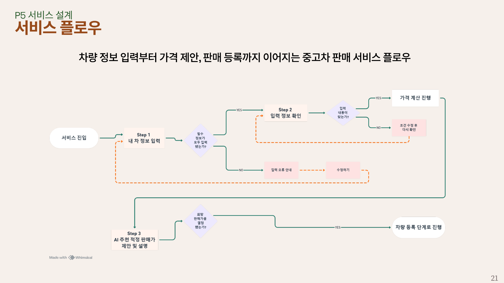
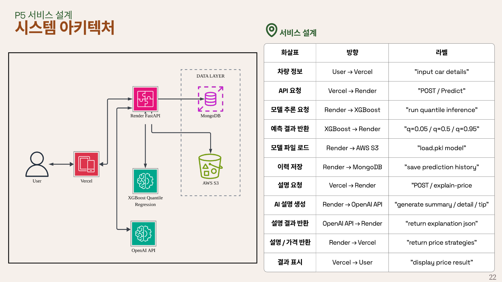
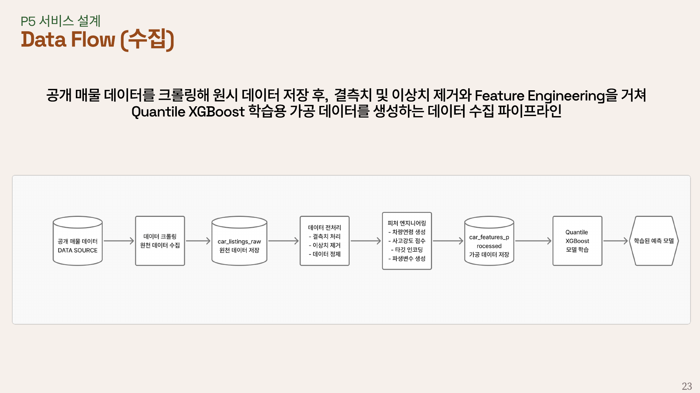
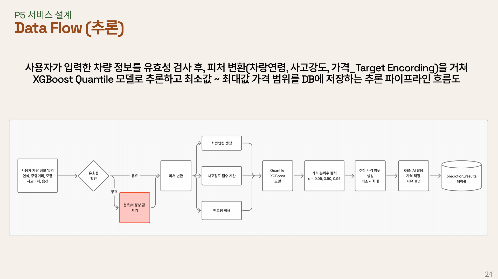
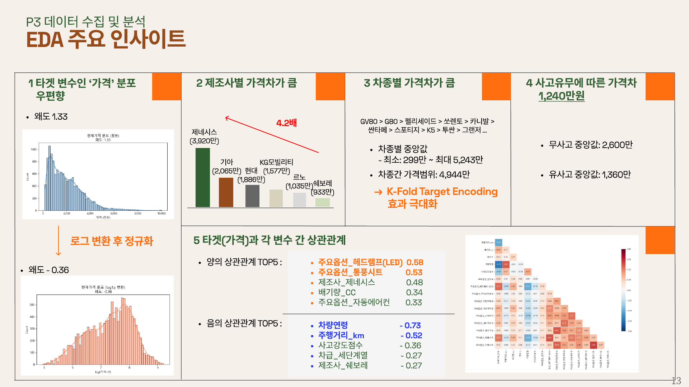
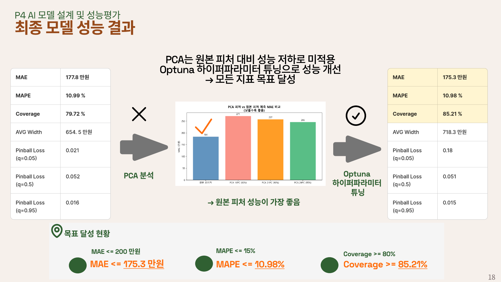

# fa08_2nd_Bermuda  | C2C 중고차 적정 판매가격 예측 및 판매 지원 서비스
> 공개 매물 중고차 데이터를 활용한 **AI 기반 가격 예측 서비스**
> 단순 가격 예측을 넘어 **판매자 상황에 맞는 가격 전략** 제안 및 판매 인사이트 제공

---
## 프로젝트 한눈에 보기

| 항목 | 내용 |
| --- | --- |
| 팀명 | **Bermuda** |
| 팀원 | 박찬호 · 이동현 · 최아영 |
| 프로젝트명 | **얼마Car** C2C 중고차 적정 판매가격 예측 및 판매 지원 서비스|
| 프로젝트 기간 | 2026-03-11 ~ 2026-03-23 |
| 데이터 출처 | 중고차 공개 매물 데이터 크롤링|
| 핵심 방법 | **XGBoost Quantile Regression** |
| 핵심 결과 | 빠른 판매가 / 적정 판매가 / 기대 판매가 제안|
| 구현 범위 | 데이터 수집 및 전처리 · EDA · 머신러닝 모델 학습 · API · 프런트엔드 · 백엔드 ·배포 |
| 웹페이지 | https://car-price-bermuda.vercel.app/ |

---
# 프로젝트 기획서

## 1. 프로젝트 배경

국내 중고차 시장은 최근 C2C (개인 간 거래) 시장의 성장이 두드러지며, 
이 시장에서 **'적정가' 신뢰도가 확보**된다면 고객 핵심 가치를 올리고 Market Challenger로써 플랫폼 위상을 공고히 할 수 있음
**AI 기반 중고차 가격 예측 서비스** 출시를 통해 시장 경쟁력 강화 및 신규 시장 진출을 통한 성장 모멘텀 기회 창출

## 2. 문제 정의

- 중고차 개인 직거래에서는 가격 정보 비대칭으로 인해 판매자가 적정 가격을 정하기 어려움
- 등록 가격이 높으면 거래가 지연되고, 낮으면 손해를 볼 수 있어 가격 결정 부담이 큼
- 단순 평균 시세나 감각적 판단만으로는 부족하며, 내 차량 상태를 반영한 맞춤형 가격 가이드가 필요
- 플랫폼 관점에서도 비합리적인 등록 가격은 문의 전환율 저하와 거래 신뢰도 하락으로 이어질 수 있음

## 3. 프로젝트 목표

- 개인 고차 판매자가 차량 조건을 바탕으로 적정 등록 가격을 합리적으로 판단할 수 있도록 지원
- 단일 가격 제시가 아닌 빠른 판매가 / 적정 판매가 / 기대 판매가의 3단계 가격 전략 제공
- 입력 검증과 검토 화면을 포함한 UX를 통해 등록 전 의사결정 정확도 향상
- 데이터 수집부터 전처리, 모델 학습, API 연동, 프런트엔드 구현, 배포까지 연결되는 서비스형 AI 프로젝트 포트폴리오 구축

## 4. 서비스 핵심 아이디어

- 사용자의 판매 목적은 모두 같지 않다는 점에 주목하여, 하나의 정답 가격이 아니라 전략형 가격 제안을 제공
- 빠르게 팔고 싶은 사용자, 적정한 수준에서 거래하고 싶은 사용자, 높은 가격을 기대하는 사용자가 각각 참고할 수 있도록 가격 결과를 구분
- 결과값만 제시하는 것이 아니라, 가격 형성 이유와 입력값 요약을 함께 제공해 설명 가능한 사용자 경험을 목표

---
# 요구사항 정의서

## 1. 기능 요구사항

- 차량 정보 입력 및 필수입력값 안내
- 입력값 유효성 검사 및 입력 정보 확인 화면 제공
- 예측 API 연동을 통한 적정가 산출
- 빠른 판매가 / 적정 판매가 / 기대 판매가 3단계 추천가 범위 제공
- 유사 차량 시세 제공
- 가격 영향 요인 안내

## 2. 비기능 요구사항

- 성능: 결과 응답 속도
- 사용성: 입력 편의성 및 결과 이해 가능성
- 신뢰성: 오류 안내
- 데이터 품질: 시세 데이터 품질
- 보안: 개인정보 보호
- 안정성: 서비스 지속성
- 호환성: 모바일 환경 지원

---
# 데이터 분석 및 모델링

## 1. 데이터 정의

- 데이터 소스 : 중고차 공개 매물 데이터
- 데이터 수집 방식: 저속 . 안정형 크롤링
- 최종 데이터셋: bermuda_data_v2.csv (13,431행 X 36열 / 결측치 0)
- 주요 피처 (36개)

| 피처 | 설명 | 타입 |
| --- | --- | --- |
| `모델` | 차종명 (K-Fold Target Encoding 대상) | 문자열 → float |
| `주행거리_km` | 총 주행거리 | 수치 (log 변환) |
| `배기량_cc` | 엔진 배기량 | 수치 (log 변환) |
| `차량연령` | 차령 (년) | 수치 (log 변환) |
| `연간_주행거리` | `주행거리 / (차량연령 + 1)` — 파생 변수 | 수치 |
| `사고강도점수` | 사고 이력 점수 (0 = 무사고) | 수치 |
| `좌석수` | 총 좌석수 | 수치 |
| `변속기` | 오토/수동 등 | 이진 (0/1)|
| `색상` | 검정색/흰색/은색 등 | 이진 (0/1)|
| `주요옵션_*` | 선루프, LED 헤드램프, 후방카메라 등 | 이진 (0/1) |
| `제조사_*` | 현대 / 기아 / 제네시스 등 | 이진 (0/1) |
| `연료_*` | 가솔린 / 디젤 / 하이브리드 등 | 이진 (0/1) |
| `차급_*` | 세단 / SUV | 이진 (0/1) |

- **타겟 변수**: `현재가격_만원` (log 변환 후 학습, 예측 시 역변환)
- **이상치 처리**: `현재가격_만원` · `주행거리_km` — IQR × 2.0 적용

## 2. 모델링 방법론

- **XGBoost Quantile Regression**: 하한값, 중간값, 상한값 구간 예측 모델 적용
- **K-Fold Target Encoding**: Data Leak 및 과적합 방지 Encoding 방식 적용
- **Optuna 하이퍼 파라미터 튜닝**: 이전 결과 학습 → 유망 영역 집중 탐색색

## 3. 성능 평가 지표

| 지표 | 정의 | 목표 |
| --- | --- | --- |
| **MAE** | 중앙값 예측의 평균 절대 오차 (만원) | 낮을수록 ↓ |
| **MAPE** | 평균 절대 백분율 오차 (%) | 낮을수록 ↓ |
| **Coverage** | 실제값이 [q=0.05, q=0.95] 구간 안에 드는 비율 | **~90%** |
| **Interval Width** | 예측 구간 평균 폭 (만원) | 좁을수록 ↓ |
| **Pinball Loss** | 분위수별 손실 함수 값 | 낮을수록 ↓ |

---
# 프로젝트 설계서

## 1. 서비스 플로우

## 2. 시스템 아키텍처

## 3. 데이터 플로우

### 3-1. 데이터 **수집** 플로우

### 3-2. 데이터 **추론** 플로우

## 4. 기술 스택

| 분야 | 라이브러리 |
| --- | --- |
| 데이터 수집 | `BeautifulSoup`, `Selenium` |
| 데이터 처리 | `pandas`, `numpy` |
| 시각화 | `matplotlib`, `seaborn` |
| 모델링 | `xgboost`, `scikit-learn`, `Quantile Regression`, `K-Fold Target Encoding`, `Optuna` |
| 프론트엔드| `Next.js`, `React`, `TypeScript`, `Tailwind CSS`, `Vercel` |
| 백엔드 | `FastAPI`, `joblib`, `OpenAI API`, `Render` |
| 배포 | `Vercel`, `Render`, `GitHub` |

---
# 시각화 리포트

## 1. EDA 분석 결과

## 2. 모델 분석 결과

## 3. 모델 적용 시뮬레이션

---
# 프로젝트 회고

### 잘한 점 (What went well)
- **반복적 개선**: 인코딩 방식을 v1(One-Hot) → v4(K-Fold TE)로 단계적으로 개선하며 문제를 체계적으로 해결
- **이론적 완성도**: Simple TE의 self-encoding 문제를 명확히 진단하고 K-Fold TE로 해결
- **구간 예측 도입**: 단순 점 예측이 아닌 90% 예측 구간 제공으로 실용성 향상
- **자동화된 튜닝**: Optuna 도입으로 하이퍼파라미터 최적화를 체계적으로 수행

### 개선이 필요한 점 (What could be improved)
- 초기 인코딩 방식 선택에서 문제를 미리 예측하지 못해 v1~v3 반복 수정 발생
- PCA 도입 시 원본 피처 대비 성능 향상이 제한적 → 차원 축소의 실용적 적용 범위 재검토 필요
- 데이터 전처리 과정에서 이상치 기준 설정에 예상보다 많은 시간 소요

### 배운 점 (Lessons learned)
- **Target Encoding의 함정**: self-encoding 문제와 K-Fold 방식으로 해결하는 방법
- **분위수 회귀의 강점**: 이분산성이 있는 데이터(비싼 차일수록 불확실성 증가)에서 예측 구간 폭이 자동으로 조절됨
- **Optuna TPE**: Grid/Random Search 대비 효율적인 하이퍼파라미터 탐색 전략
- **PCA**: 다중공선성 파악에는 유용하지만 항상 예측 성능 향상으로 이어지지는 않음

### 다음 단계 (Action items)
1. **멀티모달 서비스 진화**: 이미지 기반 차량 분석 및 텍스트+이미지+수치 데이터 모델 적용
2. **서비스 Coverage 확대**: 수입차 및 희귀모델 차량 서비스 확대
3. **실시간 시장 가격 반영**: 최신 매물 데이터 반영한 실시간 가격 업데이트 서비스 런칭

---

