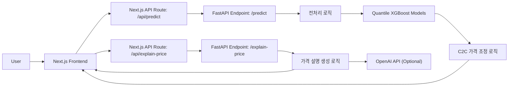

# Bermuda | C2C 중고차 적정 판매가격 예측 및 판매 지원 서비스

> **개인 중고차 판매자가 “얼마에 올려야 팔릴까?”를 더 합리적으로 판단할 수 있도록 돕는 가격 예측 서비스**  
> 공개 중고차 매물 데이터를 기반으로 차량 정보를 입력하면 **빠른 판매가 / 적정 판매가 / 기대 판매가**를 제안하고, 가격 형성 이유까지 함께 안내합니다.

<p align="left">
  
  
  
  
</p>

- **Team**: Bermuda
- **Members**: 박찬호 · 이동현 · 최아영
- **Live Demo**: <https://car-price-bermuda.vercel.app>
- **Repository**: <https://github.com/chanho0215/car_price_bermuda>

---

## 1. 프로젝트 개요

중고차 C2C 직거래에서는 판매자와 구매자 모두 적정 가격을 판단하기 어렵습니다.  
판매자는 너무 낮게 올리면 손해를 볼까 걱정하고, 너무 높게 올리면 거래가 지연될 수 있습니다. 반대로 구매자는 등록 가격이 시세에 비해 적절한지 판단하기 어려워 거래를 망설이게 됩니다.

Bermuda는 이 문제를 해결하기 위해 기획된 **중고차 판매가 예측 및 판매 지원 서비스**입니다.  
사용자가 차량 정보를 입력하면 데이터 기반으로 가격 범위를 제안하고, 단일 숫자가 아니라 **거래 전략에 맞는 3단계 가격**을 제공하여 실제 판매 의사결정까지 돕는 것을 목표로 합니다.

### 우리가 해결하고 싶은 문제

- **가격 정보 비대칭**으로 인해 개인 판매자가 적정 등록가를 정하기 어렵다.
- **시장 시세 감각의 부족**으로 인해 거래가 지연되거나 불필요한 가격 수정이 반복된다.
- 단순 시세 조회만으로는 부족하며, **내 차량 조건을 반영한 맞춤형 가격 제안**이 필요하다.
- 플랫폼 관점에서도 적정하지 않은 가격의 매물이 많아질수록 **거래 효율과 신뢰도**가 떨어질 수 있다.

### 프로젝트 목표

- 차량 조건을 반영한 **개인 직거래 중심 가격 가이드**를 제공한다.
- 사용자가 등록 직전에 가격을 한 번 더 검토할 수 있도록 **검토 중심 UX**를 설계한다.
- 단순 예측값이 아니라 **빠른 판매 / 적정 판매 / 기대 판매** 전략을 함께 제안한다.
- 예측 근거를 설명 가능한 형태로 제공해 **신뢰 가능한 가격 추천 경험**을 만든다.

---

## 2. 서비스 핵심 아이디어

Bermuda는 “예상 시세 하나”만 보여주는 서비스가 아닙니다.  
판매자의 목적이 모두 같지 않다는 점에 주목했습니다.

예를 들어,
- 빨리 팔고 싶은 판매자는 **빠른 판매가**가 더 중요할 수 있고,
- 너무 싸게 팔고 싶지 않은 판매자는 **적정 판매가**가 기준이 될 수 있으며,
- 시간이 조금 걸리더라도 높은 값을 기대하는 판매자는 **기대 판매가**를 참고할 수 있습니다.

따라서 본 서비스는 하나의 정답 가격을 강요하기보다, **판매 전략에 맞는 가격 범위와 해석**을 제공하는 방향으로 설계되었습니다.

---

## 3. 주요 기능

### 3-1. 차량 정보 입력
사용자는 다음과 같은 정보를 입력할 수 있습니다.

- 제조사
- 모델
- 트림
- 연식
- 배기량
- 연료
- 변속기
- 차급
- 좌석 수
- 색상
- 주행거리
- 사고 이력
- 교환 부위 수
- 판금 부위 수
- 보험 이력 수
- 부식 여부
- 주요 옵션

### 3-2. 입력 검증 및 검토 화면
- 입력 도중 필수값과 형식을 점검할 수 있도록 UX를 구성했습니다.
- 바로 예측 결과를 보여주기보다, **요약/검토 화면**을 두어 사용자가 입력 내용을 최종 확인할 수 있도록 설계했습니다.

### 3-3. 3단계 가격 제안
예측 결과는 단일 값이 아니라 아래 세 가지 가격으로 제시됩니다.

- **빠른 판매가**: 거래 성사 속도를 우선할 때 참고할 수 있는 가격
- **적정 판매가**: 시장성과 현실성을 함께 고려한 기준 가격
- **기대 판매가**: 시간이 더 걸릴 수 있지만 상대적으로 높은 가격

### 3-4. 가격 설명 생성
- 백엔드는 예측값과 입력 차량 정보를 바탕으로 가격 형성 이유를 설명합니다.
- OpenAI API Key가 설정된 경우 더 자연스러운 설명을 생성하고,
- 설정되지 않은 경우에도 기본 안내 문구를 제공하도록 fallback 로직을 구성했습니다.

### 3-5. 서비스형 앱 구조
- 프런트엔드와 백엔드를 분리하여 개발했습니다.
- 프런트엔드는 사용자 경험과 입력/결과 흐름을 담당하고,
- 백엔드는 전처리, 모델 로드, 예측, 설명 생성 API를 담당합니다.

---

## 4. 사용자 흐름


### 화면 구성
- **Welcome Screen**: 서비스 소개 및 시작 화면
- **Vehicle Input Screen**: 차량 정보 입력 화면
- **Summary Screen**: 입력값 검토 화면
- **Price Result Screen**: 가격 결과 및 설명 화면

---

## 5. 시스템 아키텍처



### 아키텍처 설명
- **Next.js**는 모바일 중심 웹 UI와 화면 전환을 담당합니다.
- 프런트엔드 내부 API 라우트가 백엔드와 통신하며 예측 요청을 전달합니다.
- **FastAPI**는 예측용 모델 아티팩트를 불러오고 입력값을 전처리한 뒤 가격을 산출합니다.
- 예측 결과는 분위수 기반 가격을 만든 뒤, 개인 직거래 맥락에 맞춰 조정되어 반환됩니다.
- 설명 API는 예측 결과를 사람이 이해하기 쉬운 문장으로 풀어줍니다.

---

## 6. 머신러닝 접근 방식

### 6-1. 왜 단일 가격이 아니라 가격 범위인가?
중고차 가격은 동일 모델이라도 연식, 주행거리, 사고 이력, 옵션, 상태에 따라 편차가 큽니다.  
그래서 단일 회귀값 하나만 제시하는 방식보다, **분위수 기반 예측으로 가격 범위를 함께 보여주는 접근**이 서비스 맥락에 더 적합하다고 판단했습니다.

### 6-2. 예측 방식
현재 백엔드는 **0.05 / 0.50 / 0.95 분위수 모델**을 불러와 예측을 수행합니다.

- **0.05 분위수** → 빠른 판매 측면에서 참고 가능한 하단 가격
- **0.50 분위수** → 중앙 기준 가격
- **0.95 분위수** → 상단 기대 가격

그 후, 서비스 내부 로직에서 개인 직거래 상황을 고려한 조정값을 반영하여 최종적으로 아래 세 가격을 반환합니다.

- `fastPrice`
- `fairPrice`
- `highPrice`

### 6-3. C2C 가격 조정 로직
모델의 원시 예측값을 그대로 보여주지 않고, 직거래 상황에 맞는 가격으로 보정합니다.

예를 들어,
- 고정 비용 성격의 보정값
- 가격대별 margin rate
- 빠른 판매를 위한 추가 할인 폭
- 신뢰 형성을 위한 조정 폭

등을 반영하여 **실제 등록 가격에 더 가까운 형태의 가이드 가격**으로 가공합니다.

### 6-4. 현재 버전의 한계
- 현재 백엔드는 **전기차를 지원하지 않도록 예외 처리**가 들어 있습니다.
- 향후에는 차종 확대, 데이터 범위 확대, 설명 품질 개선이 필요합니다.

---

## 7. 전처리 로직 요약

백엔드 전처리에서는 입력값을 모델 피처에 맞게 변환합니다.

### 주요 처리 내용
- 연식 기반 **차량 연령** 계산
- 주행거리와 차량 연령을 활용한 **연간 주행거리** 계산
- 사고 여부, 교환 부위 수, 판금 부위 수, 보험 이력 수, 부식 여부를 결합한 **사고강도점수** 생성
- 색상, 연료, 변속기, 차급, 제조사 등의 **라벨형 피처 변환**
- 옵션 입력값을 활용한 **옵션 피처 반영**
- 차급을 **SUV계열 / 세단계열** 등으로 재구성
- `모델_encoded` 값을 활용한 **모델 정보 인코딩 반영**
- 로그 스케일 변환
  - `주행거리_km_log`
  - `배기량_cc_log`
  - `연간_주행거리_log`
  - `차량연령_log`

이 과정은 서비스 입력 폼의 값을 **실제 학습 피처와 일관된 형태로 연결**하기 위해 중요합니다.

---

## 8. 저장소 구조

현재 저장소는 서비스 앱 중심으로 다음과 같이 구성되어 있습니다.

```text
car_price_bermuda/
├── app/                        # Next.js App Router
│   ├── api/
│   │   ├── predict/            # 프런트엔드 API 라우트
│   │   └── explain-price/      # 프런트엔드 API 라우트
│   ├── globals.css
│   ├── layout.tsx
│   └── page.tsx                # 전체 화면 흐름 제어
├── components/
│   └── screens/
│       ├── welcome-screen.tsx
│       ├── vehicle-input-screen.tsx
│       ├── summary-screen.tsx
│       └── price-result-screen.tsx
├── backend/
│   ├── models/                 # 학습 결과물 / 피처 컬럼 / 인코딩 맵
│   ├── main.py                 # FastAPI 진입점
│   ├── preprocess.py           # 입력 전처리 로직
│   ├── requirements.txt
│   └── .env.example
├── machine_learning/
│   ├── encar_feature_processed_for_quantile_safe.csv
│   └── 박찬호_머신러닝_v_catboost.ipynb
├── public/
├── .env.example
├── package.json
└── README.md
```

---

## 9. 기술 스택

| 구분 | 기술 | 설명 |
| --- | --- | --- |
| Frontend | Next.js, React, TypeScript | 모바일 중심 웹 UI 및 화면 전환 |
| Styling | CSS, Tailwind 기반 구성 | 화면 레이아웃 및 컴포넌트 스타일링 |
| Backend | FastAPI, Uvicorn, Pydantic | 예측 API, 설명 API, 요청/응답 스키마 관리 |
| Data/ML | Pandas, NumPy, scikit-learn, XGBoost | 전처리, 피처 구성, 분위수 기반 예측 |
| AI Explanation | OpenAI API | 가격 설명 문구 생성 옵션 |
| Deployment | Vercel, Render | 프런트엔드/백엔드 배포 |
| Collaboration | Git, GitHub | 형상관리 및 협업 |

### 기술 선택 이유
- **Next.js**: 화면 흐름 제어와 배포 편의성이 좋아 서비스형 UI에 적합
- **FastAPI**: 예측 API를 빠르게 구성하고 문서화하기 좋음
- **XGBoost 기반 분위수 예측**: 가격 단일값이 아닌 범위 예측에 적합
- **OpenAI API**: 숫자 결과만이 아니라 이해 가능한 설명 경험까지 제공 가능

---

## 10. 실행 방법

### 10-1. 프런트엔드 실행

```bash
npm install
copy .env.example .env.local
npm run dev
```

기본 프런트엔드 개발 서버는 로컬에서 실행되며, 내부 API 라우트를 통해 백엔드와 통신합니다.

### 10-2. 백엔드 실행

```bash
python -m venv .venv
.venv\Scripts\activate
pip install -r backend/requirements.txt
copy backend\.env.example backend\.env
npm run backend:dev
```

### 10-3. 환경 변수

#### 루트 `.env.local`
프런트엔드에서 백엔드 주소를 참조할 때 사용합니다.

```env
NEXT_PUBLIC_API_BASE_URL=http://127.0.0.1:8000
```

#### `backend/.env`
설명 생성 기능을 사용할 경우 설정합니다.

```env
OPENAI_API_KEY=your_api_key_here
```

> `OPENAI_API_KEY`가 없어도 서비스는 동작하며, 이 경우 설명 문구는 fallback 로직으로 제공됩니다.

---

## 11. API 요약

### `GET /health`
백엔드 헬스체크

### `GET /openai-health`
OpenAI API Key 및 클라이언트 초기화 상태 확인

### `POST /predict`
차량 정보를 입력받아 가격 범위를 예측

#### 예시 요청
```json
{
  "manufacturer": "기아",
  "model": "K5",
  "trim": "노블레스",
  "year": "2020",
  "displacement": "1999",
  "fuel": "가솔린",
  "transmission": "자동",
  "vehicleClass": "중형",
  "seats": "5인승",
  "color": "흰색",
  "mileage": "45000",
  "accident": "무사고",
  "exchangeCount": "없음",
  "paintCount": "없음",
  "insuranceCount": "없음",
  "corrosion": "없음",
  "options": ["선루프", "내비게이션", "스마트키"]
}
```

#### 예시 응답
```json
{
  "fastPrice": 1730,
  "fairPrice": 1810,
  "highPrice": 1880,
  "pricingMeta": {
    "fixedCost": 25,
    "marginRate": 0.07,
    "fastDiscount": 18,
    "trustDiscount": 10,
    "baseQ50": 1895
  }
}
```

### `POST /explain-price`
예측 가격과 차량 정보를 바탕으로 자연어 설명 생성

---

## 12. 프런트엔드 구현 포인트

### 12-1. 단계형 입력 UX
- 사용자가 한 번에 많은 정보를 입력해야 하므로, 단계별 입력 구조를 적용했습니다.
- 긴 폼을 한 화면에 몰아넣지 않고, 화면 단위로 나누어 인지 부담을 줄였습니다.

### 12-2. 검토 중심 흐름
- 결과를 바로 보여주는 대신 **Summary Screen**에서 입력값을 다시 점검하도록 설계했습니다.
- 실제 서비스에서 가격 예측 오류를 줄이려면 입력 정확도가 중요하다고 판단했습니다.

### 12-3. 모바일 퍼스트 레이아웃
- 전체 앱은 모바일 화면 폭에 맞춘 단일 컬럼 구조로 정리했습니다.
- 포트폴리오 시연, 발표, 데모 링크 공유에 모두 적합하도록 구성했습니다.

---

## 13. 데이터 파이프라인 관점에서의 프로젝트 범위

이 프로젝트는 단순히 “예측 API만 만든 프로젝트”가 아니라, 아래 흐름 전체를 포함하는 서비스 포트폴리오로 볼 수 있습니다.


---

## 14. 향후 개선 방향

### 서비스 측면
- 전기차, 수입차 등 지원 범위 확대
- 차량 상태 입력 항목 세분화
- 검색 유입 및 문의 전환을 고려한 등록가 추천 고도화
- 결과 화면에서 가격 근거 시각화 강화

### 모델 측면
- 추가 데이터 확보 및 품질 관리
- 지역, 판매 시기, 인기 옵션 등 설명 변수 확장
- 모델 성능 비교 실험 체계화
- 예측 신뢰구간 해석 개선

### 제품 측면
- 히스토리 저장 기능
- 즐겨찾기 / 최근 예측 조회
- 사용자 피드백 기반 추천가 보정
- 판매 전략 추천 문구 고도화

---

## 15. 회고 포인트로 쓰기 좋은 문장

- “예측 정확도 자체뿐 아니라, 사용자가 실제로 가격을 결정할 수 있게 돕는 서비스 경험을 설계하는 데 집중했습니다.”
- “모델 결과를 그대로 노출하지 않고, 개인 직거래 상황에 맞는 가격 구조로 재해석했습니다.”
- “데이터 수집, 전처리, 모델링, API 서빙, 프런트엔드 구현, 배포까지 이어지는 전 과정을 직접 연결해 본 프로젝트입니다.”

---

## 16. License

```text
This project is for educational and portfolio purposes.
```
---

## 17. 마무리

Bermuda는 중고차 개인 판매자가 가격을 더 합리적으로 정할 수 있도록 돕기 위한 프로젝트입니다.  
단순한 회귀 모델 실험을 넘어, **사용자 입력 → 가격 예측 → 가격 해석 → 서비스 UI → 배포**까지 연결되는 실제 서비스형 프로젝트로 발전시키는 것을 목표로 했습니다.

이 저장소는 앞으로도 **데이터 수집, 전처리, 모델 개선, 서비스 고도화**가 계속 확장될 수 있는 기반이 되도록 구성하고 있습니다.
